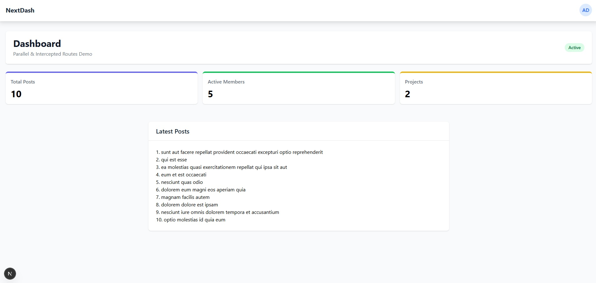

# 🚀 Next.js Advanced Dashboard with Parallel & Intercepted Routes

  
_Modern dashboard with modal interactions_

## ✨ Key Features

1. **Advanced Routing Patterns**

   - 🧩 Parallel Routes for multiple content streams
   - 🎣 Intercepted Routes for contextual modals

2. **Professional Dashboard**

   - 📊 Interactive metrics cards
   - 📑 Posts list with modal quick-view

3. **Tech Stack**
   - ⚛️ Next.js 15 (App Router)
   - 🎨 Tailwind CSS + CSS Animations
   - 🚀 Server Actions for mutations  

## 🚀 Getting Started
   - Docker
   - pnpm

Instalation:
   - git clone
   - cd repo
   - pnpm i
   - create .env
   - docker compose -f docker-compose.(dev||prod).yaml up -d --build